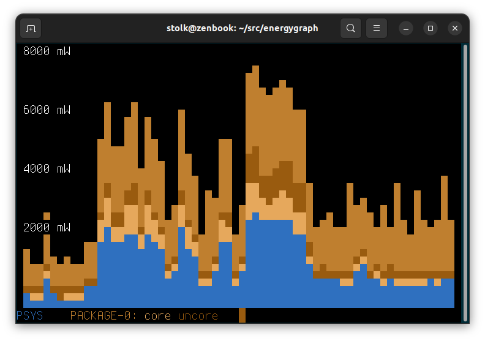

# energygraph

Graphs the energy use of a host inside a text terminal, using intel-rapl data from the /sys filesystem.

## Building

$ make

## Running

$ sudo ./energygraph

## Interpreting

See the legend: top level zones are reported in capitals.

sub-zones have the same colour hue as parent.

Zone domains:

 * psys: Platform.
 * package-N: A CPU.
 * core: On CPU package. Cores of a CPU.
 * uncore: On CPU package, but not a core. Typically a gpu.
 * dram: Memory.

## Compatibility

Known to work on AMD as well.

Requires /sys/devices/virtual/powercap/intel-rapl/ entries.

Requires root privileges.

## Copyright

Copyright 2022 by Bram Stolk, licensed using the MIT Open Source License.

