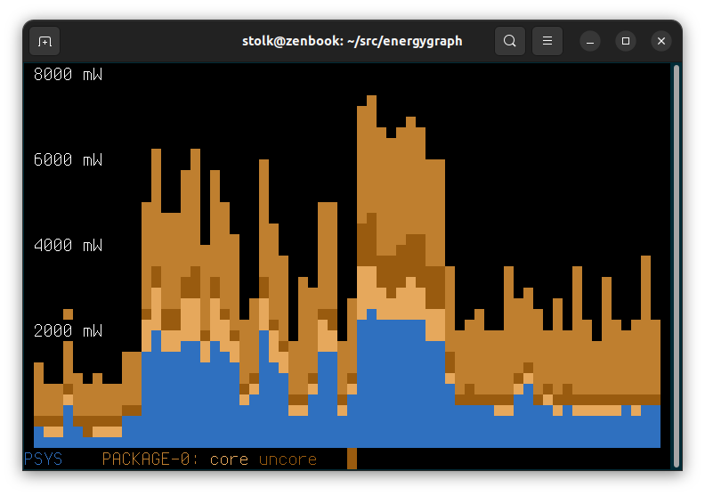

# energygraph

Graphs the power use of a host inside a text terminal, using:

 * intel-rapl data from the /sys filesystem.
 * hwmon data from the /sys filesystem.
 * nvidia data from libnvidia-ml.so.1 (if installed.)

Because the plot ticks at 1 sample per second, you can either read the values as power (Joules per second, or Watt) or as an absolute energy value (Joules.)

## Dependencies

NONE (but for NVIDIA support, runtime dep on libnvidia-ml1, no build deps.)

## Building

$ make

## Running

$ sudo ./energygraph

## Interpreting

See the legend: top level zones are reported in capitals.

sub-zones have the same colour hue as parent.

Zone domains:

 * psys: Platform.
 * package-N: A CPU.
 * core: On CPU package. Cores of a CPU.
 * uncore: On CPU package, but not a core. Typically an iGPU.
 * dram: Memory.
 * XE: Intel iGPU/dGPU.
 * AMDGPU: AMD iGPU/dGPU.

## Compatibility

Known to work for Intel and AMD CPUs. Known to work with Intel/AMD/NVIDIA GPUs.

Requires /sys/devices/virtual/powercap/intel-rapl/ entries.

Requires root privileges.

## Copyright

Copyright 2022-2026 by Bram Stolk, licensed using the MIT Open Source License.

